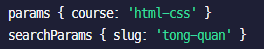
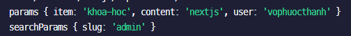
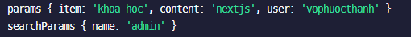

# Routing

- Basic: Thư mục có file: `page.tsx` -> sign-in: `page.tsx` sẽ tạo ra đường dẫn là /sign-in. Lưu ý, trong thư mục phải có file `page.tsx`
- Dynamic: tạo folder có dấu []
- Group:nó sẽ không tạo ra routing, ví dụ như `(dashboard)` sẽ không tạo ra /dashboard. Nếu truy cập thì sẽ hiển thị not found, mục đíhc sử dụng để gom các routing chó chung layout vào chung

```js
dashboard;
```

- Nested: routing lồng nhau, các thư mục lồng nhau (vì mỗi thư mục là 1 page)

```js
/hello/haha/page.tsx;
hello là segmet 1
haha là segmet 2
```

[] cos nghiax laf dynacmic routing => nó là params

- Segment: [name] -> [course] về cơ cái này là dynamic segment (linh động), mục đích để lấy các params ra để xử lý 1 cong việc gì đó. Ví dụ lấy bài học từ khóa thì mình sẽ có cấu trúc: [course]/lesson/page.tsx

```js
[course]/lesson.p
ex: http://localhost:3000/hi/lesson?%C3%A1dasdsad=

```

- Catch-all Segment: sign-in/[...sign-in]
- Optional Catch-all Segment: sign-in/[[...sign-in]]
- Parallel Routes
- Intercepting Routes

# Params

- Params: param chỉ có ở dynamic routing
  vd: http://localhost:3000/html-css/lesson?slug=tong-quan
  
- Lưu: khi để 2 ngoặc vuông cùng cấp thì không được (báo lỗi). Vì khi đấy thì nó cx sẽ hiểu thằng [] thứu nhất, và nó cx hiểu là [] thứ 2
- Search Params: Thường là những query ở trên url như: lesong?slug=html-css thì _slug_ chính là searchParams
  vd2: http://localhost:3000/khoa-hoc/nextjs/vophuocthanh/account?slug=admin
  
  vd3: http://localhost:3000/khoa-hoc/nextjs/vophuocthanh/account?name=admin
  

## Next/Link

- Link: dùng Link của next-link để có thể chuyển qua lại giữa các page 1 cách mượt mà và không bị reload lại trang
- href: đường dẫn đến url

```js
<Link href={{ pathname: url, query: { slug: 'hello' } }}></Link>
```

- replace: sử dụng để khi truy cập 1 trang nào đó, thì bạn muốn back lại trang trước đó thì ko được (tùy vào mục đích sử dụng)
- scroll: mặc địch là `true` nghĩa là khi nhấn vào link thì sẽ scroll lên trên cùng, nếu không muốn scroll thì thiết lập thành `false`
- prefetch: prefetch không sử dụng được ở trang động (server), chỉ sử dụng được những trang tĩnh (client). Lưu ý: prefetch chỉ có tác dụng trên môi trường production

## Hook

- hook `usePathname()`: sử dụng để nhận đường dẫn hiện tại, sử dụng cho việc active link hiện tại
