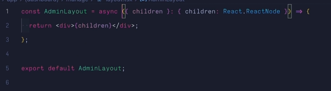

# Routing

- Basic: Thư mục có file: `page.tsx` -> sign-in: `page.tsx` sẽ tạo ra đường dẫn là /sign-in. Lưu ý, trong thư mục phải có file `page.tsx`
- Dynamic: tạo folder có dấu []
- Group:nó sẽ không tạo ra routing, ví dụ như `(dashboard)` sẽ không tạo ra /dashboard. Nếu truy cập thì sẽ hiển thị not found, mục đíhc sử dụng để gom các routing chó chung layout vào chung

```js
dashboard;
```

- Nested: routing lồng nhau, các thư mục lồng nhau (vì mỗi thư mục là 1 page)

```js
/hello/haha/page.tsx;
hello là segmet 1
haha là segmet 2
```

[] cos nghiax laf dynacmic routing => nó là params

- Segment: [name] -> [course] về cơ cái này là dynamic segment (linh động), mục đích để lấy các params ra để xử lý 1 cong việc gì đó. Ví dụ lấy bài học từ khóa thì mình sẽ có cấu trúc: [course]/lesson/page.tsx

```js
[course]/lesson.p
ex: http://localhost:3000/hi/lesson?%C3%A1dasdsad=

```

- Catch-all Segment: sign-in/[...sign-in]
- Optional Catch-all Segment: sign-in/[[...sign-in]]
- Parallel Routes
- Intercepting Routes

useRouter() => Client Component
redirect() => Server Component

# Params

- Params: param chỉ có ở dynamic routing
  vd: http://localhost:3000/html-css/lesson?slug=tong-quan
  
- Lưu: khi để 2 ngoặc vuông cùng cấp thì không được (báo lỗi). Vì khi đấy thì nó cx sẽ hiểu thằng [] thứu nhất, và nó cx hiểu là [] thứ 2
- Search Params: Thường là những query ở trên url như: lesong?slug=html-css thì _slug_ chính là searchParams
  vd2: http://localhost:3000/khoa-hoc/nextjs/vophuocthanh/account?slug=admin
  
  vd3: http://localhost:3000/khoa-hoc/nextjs/vophuocthanh/account?name=admin
  

## Next/Link

- Link: dùng Link của next-link để có thể chuyển qua lại giữa các page 1 cách mượt mà và không bị reload lại trang
- href: đường dẫn đến url

```js
<Link href={{ pathname: url, query: { slug: 'hello' } }}></Link>
```

- replace: sử dụng để khi truy cập 1 trang nào đó, thì bạn muốn back lại trang trước đó thì ko được (tùy vào mục đích sử dụng)
- scroll: mặc địch là `true` nghĩa là khi nhấn vào link thì sẽ scroll lên trên cùng, nếu không muốn scroll thì thiết lập thành `false`
- prefetch: prefetch không sử dụng được ở trang động (server), chỉ sử dụng được những trang tĩnh (client). Lưu ý: prefetch chỉ có tác dụng trên môi trường production

## Hook

- hook `usePathname()`: sử dụng để nhận đường dẫn hiện tại, sử dụng cho việc active link hiện tại

## Next/Image

- Image sẽ có 2 thuộc tính bắt buộc là `src` và `alt`, nếu k set `width` và `height` của nó thì nó sẽ bị lỗi, cách fix là dùng `fill`, nhưng khi dùng fill thì ảnh sẽ bị absolute, nếu muốn nó k bị tràn thì cho thằng cha bao nó là relative. Nếu dùng `fill` thì k cần `width` và `height`

## Page and Layout

- page.tsx và layout.tsx thì có thể dùng dược ở server side,
  

## CLerk Auth

- auth() sẽ dùng ở server, còn useAuth() sẽ dùng ở client chứ k dùng đc ở phía server

## 1 số trick về typeScript

- Trong file index.d.ts (nói chung file có .d.ts) là không chứa đc enum, không cho phép dùng enum trong .d.ts

## Kiến thức về Mongose

- Schema trong Mongoose là một đối tượng xác định cấu trúc của tài liệu (document) trong một collection của MongoDB. Nó cho phép định nghĩa các trường (fields), kiểu dữ liệu (data types) và các ràng buộc (constraints) cho dữ liệu.

## Tech

- slugify: biến title thành đường dẫn. VD: khóa học typescript => khoa-hoc-typescript
- Partial<ICourse>: Bien tat ca nhung kieu trong ICourse thanh khong bat buoc (o trong typecript)
- revalidatePath: khi ma cap nhat xong thi no se tu dong refecth lai data, giong nhu refecth o trong react query

## Mongose

- `find`: Cho phép tìm nhiều, xử lý tìm kiếm, phân trang...
- `findById`: Tìm theo Id
- `findByIdAndUpdate`: Tìm theo Id và cập nhật thông tin mới
- `findOne`: Dùng để tìm một cái có thể theo bất kỳ field nào ví dụ slug, title,...
- `findOneAndUpdate`: Tìm một cái nào đó thỏa mãn điều kiện và cập nhật thông tin mới
- Để trả ra dữ liệu mới thì thêm options {new: true} vào sau cùng

```js
const res = await Lecture.findByIdAndUpdate(params.lectureId, params.updateData, {
  new: true,
});
```

- Như ở trên thì Lecture sẽ tìm theo `lectureId` sau đó cập nhật thông tin từ `params.updateData` và thêm options là` new: true` để trả ra bản ghi đã được cập nhật mới
- Ví dụ khác:

```js
await Course.findOne({ slug });
await Course.findOneAndUpdate({ slug: params.slug }, params.updateData, {
  new: true,
});
```

- `populate`: Sử dụng populate("path") trong đó path chính là tên field trong model ví dụ course.model có field là lectures liên kết với Collection Lecture thì sẽ giúp chúng ta chọn được hết toàn bộ các documents từ Collection Lecture
- Trong trường hợp để tối ưu thì chúng ta có thể `select` từng field mà chúng ta muốn, còn muốn kiểm tra điều kiện thì dùng `match`, model thì import Model từ chỗ chúng ta tạo.
- Ví dụ

```js
const findCourse = await Course.findOne({ slug }).populate({
  path: 'lectures',
  model: Lecture,
  select: '_id title',
  match: {
    _destroy: false,
  },
  populate: {
    path: 'lessons',
    model: Lesson,
    match: {
      _destroy: false,
    },
  },
});
```
